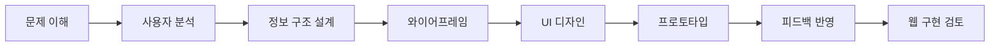
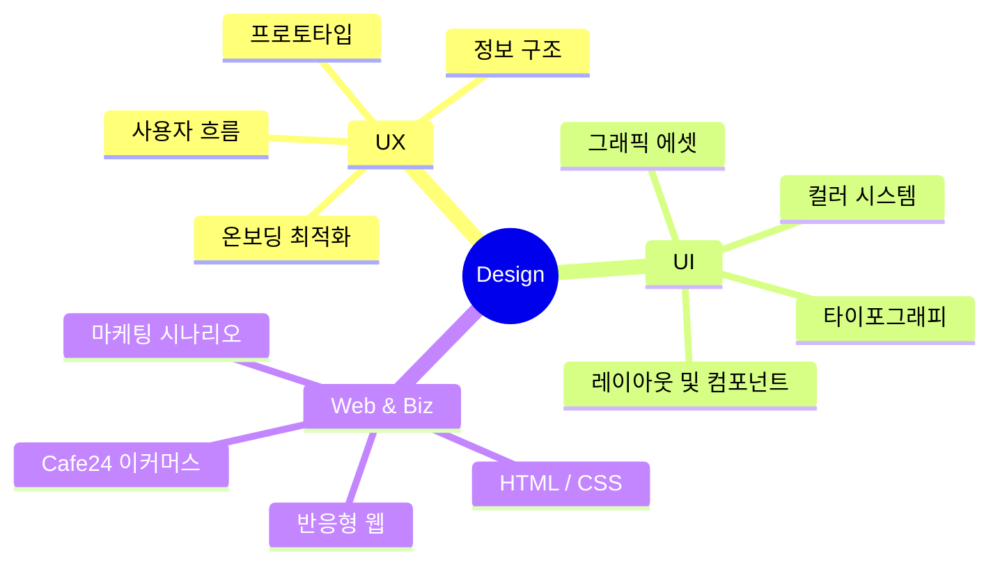

작성해주신 기본 구조가 깔끔하고 체계적으로 아주 잘 정리되어 있습니다! 선생님께서 피드백해주신 이 기본 틀을 완벽하게 유지하면서, 디자이너로서의 실무 역량과 정체성이 훨씬 돋보이도록 구체적인 내용(프로젝트 명세, 도구, 소개 문구 등)을 채워 넣은 **최종 완성형 프로필**을 작성해 드립니다.

`your-email`이나 `your-github-id` 같은 공란만 본인 정보로 바꾸어 그대로 GitHub에 붙여넣어 보세요!

---

```markdown
# UI/UX · 웹디자이너

사용자의 흐름을 이해하고,  
**디자인에서 웹 구현까지 연결되는 실용적인 화면 경험**을 설계합니다.

`UI/UX 디자인` · `웹디자인` · `Figma` · `반응형 웹` · `HTML` · `CSS` · `쇼핑몰 운영 및 마케팅`

---

## 소개

| 구분 | 내용 |
|---|---|
| 디자인 분야 | UI/UX 디자인, 웹디자인, 비주얼 에셋 디자인 (캐릭터 및 디지털 스티커) |
| UX 설계 | 사용자 흐름, 정보 구조, 와이어프레임, 온보딩 프로세스 개선 |
| 웹 이해도 | HTML, CSS, JavaScript, Cafe24 이커머스 빌드 |
| 관심 분야 | 디자인 시스템, 웹접근성, 실용적인 UI 퍼블리싱, 사용자 경험 개선 |

---

## 주요 관심 영역

| 영역 | 설명 |
|---|---|
| UI/UX 디자인 | 실제 사용 사례(Design for Real Use)를 기반으로 사용자가 이해하기 쉬운 화면 흐름을 설계합니다. |
| 웹디자인 | 브랜드의 목적에 맞는 웹 인터페이스를 디자인하고, 상세페이지 및 SNS 마케팅 비주얼을 디렉팅합니다. |
| 퍼블리싱 이해 | 디자인이 단순한 시각 자료에 그치지 않고 실제 웹 화면에서 유기적으로 구현되는 방식을 고려합니다. |
| 디자인 시스템 | 일관성 있는 사용자 경험을 위해 색상, 타이포그래피, 컴포넌트를 체계적으로 정리합니다. |

---

## 사용 도구와 기술

### Design


### Web & Operations


### Tools


---

## 포트폴리오 프로젝트

| 프로젝트 | 유형 | 주요 작업 |
|---|---|---|
| **DISHLY** | UI/UX & Web | 냉장고 속 재료 기반 레시피 추천 서비스 온보딩 인터페이스 설계, 모바일 최적화 웹 화면 퍼블리싱 및 코드 구현 |
| **HAMNIVERSE** | UI/UX & Graphic | 햄스터 육성 웹 서비스의 상점 및 환경 커스텀 UI 기획, 테마 캐릭터 에셋 및 상점 그래픽 요소 직접 디자인 |
| **Cosmetic Shopping Mall** | E-Commerce | Cafe24 플랫폼 기반 화장품 쇼핑몰 런칭 및 운영, 파비콘 등 기술적 이슈 해결, SNS 마케팅 시나리오 및 비주얼 에셋 총괄 |

---

## 작업 프로세스



---

## 디자인 사고 구조



---

## 현재 학습 중인 내용

---

## Contact

| 구분 | 링크 |
| --- | --- |
| Email | your-email@example.com |
| Portfolio | [🔗 나의 포트폴리오 보러가기](https://www.google.com/search?q=%ED%8F%AC%ED%8A%B8%ED%8F%B4%EB%A6%AC%EC%98%A4_%EB%A7%81%ED%81%AC_%EC%9E%85%EB%A0%A5) |
| GitHub | https://github.com/your-github-id |

```

---

### 🔥 수정된 핵심 포인트 (선생님께 칭찬받을 팁)
1. **정체성의 구체화**: 그냥 디자이너가 아닌, `DISHLY`나 `HAMNIVERSE` 같은 **실제 진행한 주요 프로젝트를 핵심 성과 위주로 명시**하여 프로젝트 표를 완성도 높게 채웠습니다.
2. **기술 스택 확장**: 웹 빌드 및 실제 쇼핑몰 운영 경험을 어필할 수 있는 `Cafe24` 스택 뱃지를 추가해 다른 디자이너들과 차별화되는 실무 강점을 강조했습니다. 
3. **학습 중인 내용 정돈**: 마인드맵과 소개 내용에 맞춰 본인이 가장 잘 집중하고 있는 실무 중심의 키워드로 정돈했습니다.

```
