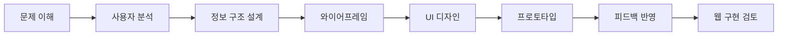
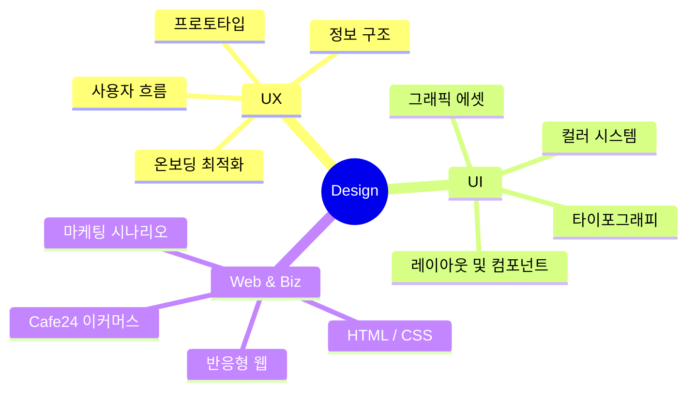

# UI/UX · 웹디자이너

작은 불편을 지나치지 않고 
**그 이유를 끝까지 고민**하는 UI/UX 디자이너 김나연입니다.

`UI/UX 디자인` · `웹디자인` · `Figma` · `반응형 웹` · `HTML` · `CSS` · `쇼핑몰 운영 및 마케팅`

---

## 소개

| 구분 | 내용 |
|---|---|
| 디자인 분야 | UI/UX 디자인, 웹디자인, 비주얼 에셋 디자인 (캐릭터 및 디지털 스티커) |
| UX 설계 | 사용자 흐름, 정보 구조, 와이어프레임, 온보딩 프로세스 개선 |
| 웹 이해도 | HTML, CSS, JavaScript, Cafe24 이커머스 빌드 |
| 관심 분야 | 디자인 시스템, 웹접근성, 실용적인 UI 퍼블리싱, 사용자 경험 개선 |

---

## 주요 관심 영역

| 영역 | 설명 |
|---|---|
| UI/UX 디자인 | 실제 사용 사례(Design for Real Use)를 기반으로 사용자가 이해하기 쉬운 화면 흐름을 설계합니다. |
| 웹디자인 | 브랜드의 목적에 맞는 웹 인터페이스를 디자인하고, 상세페이지 및 SNS 마케팅 비주얼을 디렉팅합니다. |
| 퍼블리싱 이해 | 디자인이 단순한 시각 자료에 그치지 않고 실제 웹 화면에서 유기적으로 구현되는 방식을 고려합니다. |
| 디자인 시스템 | 일관성 있는 사용자 경험을 위해 색상, 타이포그래피, 컴포넌트를 체계적으로 정리합니다. |

---

## 사용 도구와 기술

### Design


### Web & Operations


### Tools


---

## 포트폴리오 프로젝트

### 🌐 웹사이트 & UI/UX 디자인 (Structure & Flow)

| 프로젝트 | 유형 | 주요 작업 및 핵심 역량 |
|---|---|---|
| **대구트립인포 (대구여행 정보 사이트)** | UI/UX & Frontend | 대구의 대표 관광지, 맛집, 쇼핑 명소를 소개하는 웹사이트 **리디자인** 및 **전체 화면 반응형 웹 코딩(퍼블리싱) 직접 구현** |
| **K-FOOD 레시피·체험 (리디자인)** | Web Redesign | 한식 레시피 및 체험 사업 소개 페이지의 정보 구조(IA)를 직관적으로 개편하고, 브랜드 정체성을 살린 비주얼 레이아웃으로 **리디자인** |
| **DISHLY** | UI/UX & Web | 냉장고 속 재료 기반 레시피 추천 서비스 온보딩 인터페이스 설계, 모바일 최적화 웹 화면 퍼블리싱 및 **코드 구현** |
| **HAMNIVERSE** | UI/UX & Graphic | 햄스터 육성 웹 서비스의 상점 및 환경 커스텀 UI 기획, 테마 캐릭터 에셋 및 상점 그래픽 요소 직접 디자인 |
| **디저트 이커머스 쇼핑몰** | E-Commerce | 다이어터를 위한 일반/무가당 분리 콘셉트 쇼핑몰 기획, Cafe24 플랫폼을 활용한 상품 등록, 레이아웃 커스텀 빌드 |

#### 📄 상세페이지 & 랜딩페이지 (Detail & Landing Pages)

| 프로젝트 | 유형 | 주요 작업 및 핵심 역량 |
|---|---|---|
| **MUMCHIT 뉴트로 다마고치 키링** | Marketing Landing Page | Y2K/키치 감성을 극대화한 랜딩페이지 기획 및 디자인. 픽셀 아트, 윈도우 팝업 UI 등 트렌디한 비주얼 에셋 제작 |
| **초록이 다이어트 건강보조제** | Product Detail Page | 제품의 성분과 효과를 직관적인 인포그래픽과 깔끔한 레이아웃으로 풀어낸 상세페이지 디자인. 구매 전환 유도 전략 반영 |
| **익산 떡 방앗간 전통 간식** | E-commerce Detail Page | 전통 식품의 신뢰도를 높이는 화이트 톤의 깔끔한 상세페이지 디자인. 제품의 식감과 제조 과정을 시각적으로 강조 |

#### 🖼️ SNS 카드뉴스 & 포스터 (SNS & Poster Design)

| 프로젝트 | 유형 | 주요 작업 및 핵심 역량 |
|---|---|---|
| **제26회 대구 마라톤 대회** | Event Poster | 스포츠 이벤트의 에너지를 전달하기 위해 강렬한 타이포그래피와 역동적인 컬러 일러스트를 결합한 포스터 디자인 |
| **한율 수분진정 어린쑥 토너** | SNS Card News | 뷰티 브랜드의 차분한 감성을 살린 톤앤매너와 제품의 특징을 명확하게 전달하는 깔끔한 인포그래픽 중심의 카드뉴스 디자인 |
| **메가커피 블루레몬에이드** | F&B Card News | 식음료 브랜드의 청량하고 시원한 이미지를 강조하기 위해 컬러감과 이미지 연출을 극대화한 시네마그래피 카드뉴스 디자인 |
|**뚜레쥬르 메론빵**| F&B Card News | 베이커리 브랜드의 친근하고 위트 있는 이미지를 강조하기 위해 키치한 타이포그래피와 제품의 질감을 극대화한 일러스트 레이아웃 디자인  |
---

## 작업 프로세스



---

## 디자인 사고 구조



---

## 현재 학습 중인 내용

<p align="left">
  
  
  
  
</p>
---

## Contact

| 구분 | 링크 |
| --- | --- |
| Email | mailto:kny45112003@gmail.com |
| Portfolio | [🔗 나의 포트폴리오 보러가기](https://kny45112003-hue.github.io/portfolio-website/) |
| GitHub | [https://github.com/your-github-id](https://github.com/kny45112003-hue) |

```


